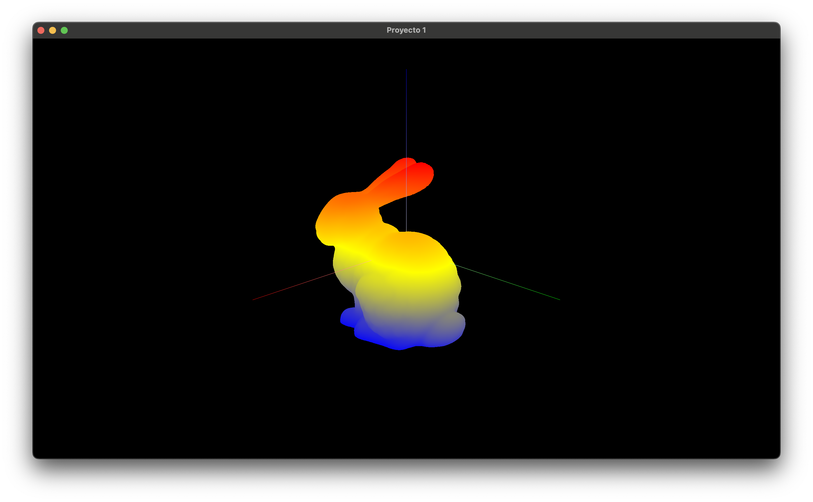
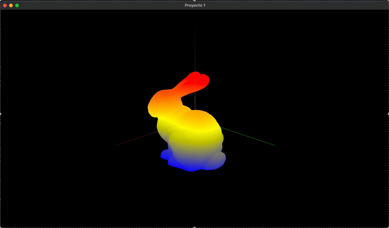
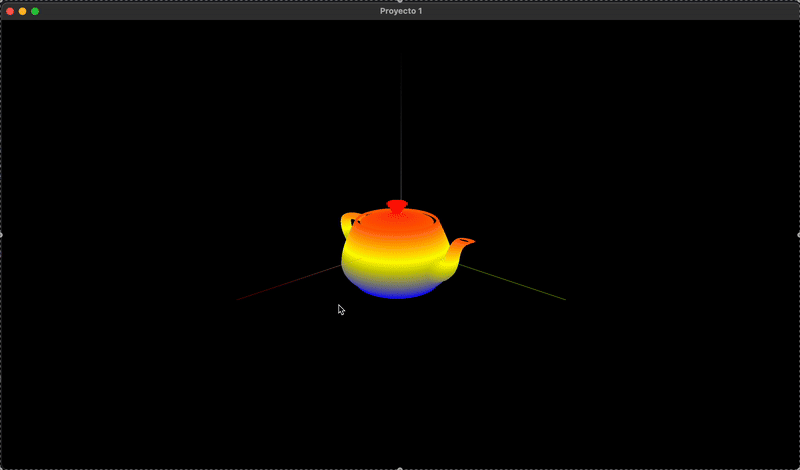
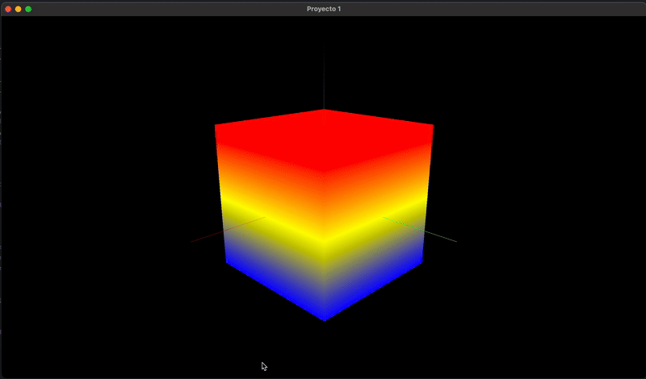
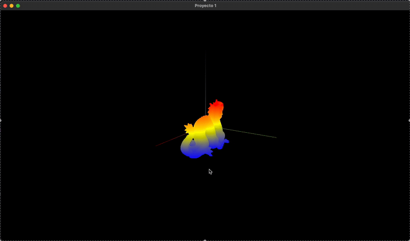

# Visualización Proyecto 1: Lector de Archivos Obj
### Alumno: Ramón Arcos Morales. No.cuenta: 319541478
## Requerimientos
Para ejecutar el proyecto es necesario tener instalado [cmake](https://cmake.org),[glew](https://glew.sourceforge.net), [glfw](https://www.glfw.org)  y [glm](https://github.com/g-truc/glm). Este proyecto se basa en la siguiente [plantilla](https://github.com/diegodmag/OpenGLFundations/tree/main/templates/t_02).
## Instrucciones

Para compilar el proyecto, es necesario ejecutar lo siguiente:
```
cd Proyecto1
cmake -B build
cmake --build build --parallel 
```
Una vez compilado el proyecto, se ejecuta con:
```
./build/going_3d
```
## Características

Al ejecutar el proyecto, se visualiza lo siguiente:


Se tiene consistentemente el origen coordenado, donde el eje x es de color verde, el y de color azul y el eje z de color rojo.


El proyecto tiene 5 modelos cargados en todo momento. Para cambiar entre modelos, se requeire pulsar las teclas 0,1,2,3,4 según sea el caso:



Cada que se selecciona un modelo, se imprime su información en terminal.


Cada modelo puede ser visualizado como una nube de puntos (GL_POINTS), un conjunto de líneas (GL_LINES) o una superficie (GL_TRIANGLES). Para seleccionar el modo GL_POINTS se requiere pulsar la tecla P, para GL_LINES la tecla L y para GL_TRIANGLES la tecla T.



Así mismo, cada modelo puede realizar rotaciones alrededor de cualquier eje coordenado. Para comenzar la rotación es necesario presionar la tecla del eje deseado para rotar. Es decir, la tecla X para el eje X, la tecla Y para el eje Y y la tecla Z para el eje Z. Para detener la rotación se requeire presinar la tecla N.



Finalmente, es posible controlar la cámara mediante las flechas del teclado. Las flechas izquierda y derecha controlan la cámara en el eje X y las flechas arriba y abajo en el eje Z. Para restablecer la cámara es necesario presionar la tecla R.



El mapa de color utilizado muestra los puntos más bajos de color azul, los medios de amarillo y los más altos de rojo. 